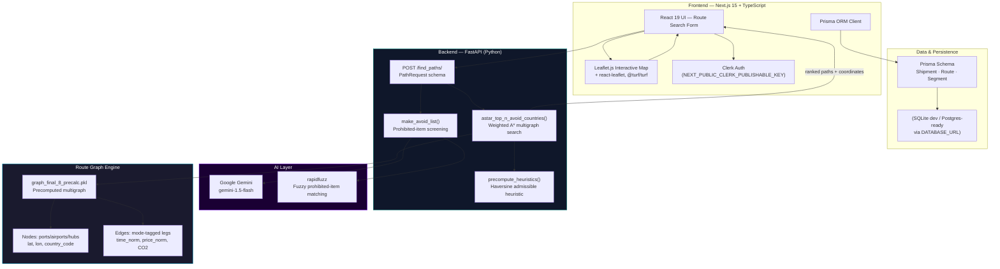
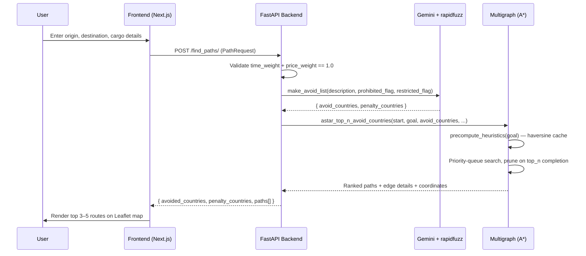
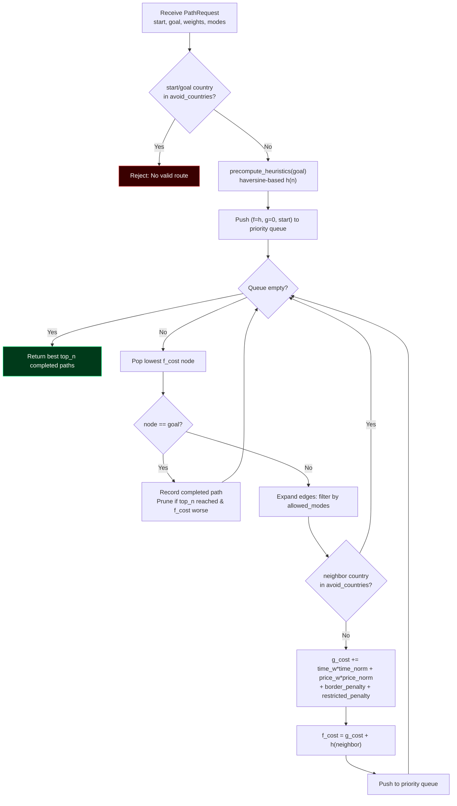
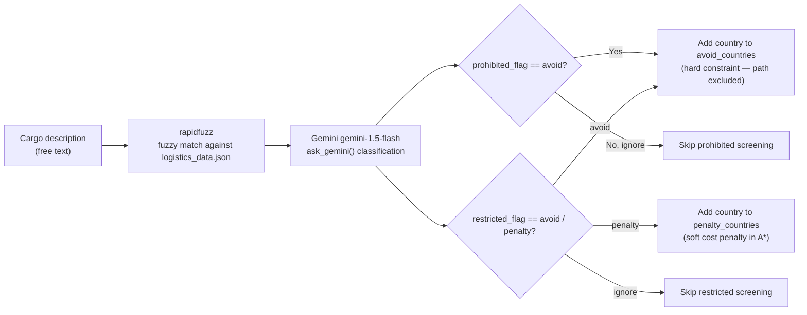

<div align="center">


# 🌍 GlobalRoute Navigator — AI-Powered Cross-Border Logistics Route Optimizer

**A\* search over a real multi-modal transport graph — air, sea, and land — that returns the top-N Pareto-efficient shipping routes ranked by cost, transit time, regulatory feasibility, and CO₂ footprint, with AI-driven prohibited/restricted-item screening.**

[](https://global-route-navigator.vercel.app/)
[](https://youtu.be/nwLRME7-Wc8?si=xyM3Lw-y1a284dO8)
[](https://github.com/Aaditya1273/GlobalRoute-Navigator)
[](./LICENSE)
[](https://nextjs.org)
[](https://fastapi.tiangolo.com)
[](https://python.org)
[](./SECURITY.md)

**[🚀 Live App](https://global-route-navigator.vercel.app/) · [🎥 Demo Video](https://youtu.be/nwLRME7-Wc8?si=xyM3Lw-y1a284dO8) · [📦 Source](https://github.com/Aaditya1273/GlobalRoute-Navigator) · [🔧 Quick Start](#-development--quick-start-guide) · [🛡️ Security](./SECURITY.md)**

</div>

---

## Table of Contents

1. [Executive Summary & Impact Metrics](#-executive-summary--impact-metrics)
2. [Architecture & Data Flow](#-architecture--data-flow)
3. [Technical Deep-Dive](#-technical-deep-dive-flagship-features)
4. [Tech Stack](#-tech-stack)
5. [Directory Structure](#-directory-structure)
6. [Development & Quick Start Guide](#-development--quick-start-guide)
7. [Testing & Verification](#-testing--verification)
8. [Security Controls & Roadmap](#-security-controls--roadmap)

---

## 🎯 Executive Summary & Impact Metrics

### The Problem

Cross-border freight planning is a **multi-objective shortest-path problem over a heterogeneous transport graph**: shippers must jointly optimize cost, transit time, and carbon footprint across air/sea/land legs, while respecting **regulatory feasibility** — country-level import/export bans and item-specific prohibited/restricted-goods rules that vary per corridor. Manually cross-referencing customs regulations against route options creates both latency and compliance risk before a shipment even departs.

### The Solution

GlobalRoute Navigator precomputes a global multi-modal transport graph (nodes = ports/airports/land hubs with geocoordinates and country codes; edges = mode-tagged legs with cost/time/CO₂ weights) and runs a **weighted A\* search with a haversine-distance admissible heuristic** to return the top-N non-dominated routes in a single request. A Gemini-backed prohibited-items classifier screens the shipment description against country-level restriction data *before* the search runs, converting regulatory rules into hard `avoid_countries` constraints or soft `penalty_countries` cost penalties inside the same optimization pass.

### Benchmark Table

| Metric | Value | Mechanism |
|---|---|---|
| Route candidates returned | Top 3–5 per query (`top_n`, configurable) | Priority-queue A\* with completed-path pruning |
| Transport modes supported | Air, Sea, Land + hybrid multi-leg | `allowed_modes` filter on multigraph edges |
| Heuristic admissibility | Haversine great-circle distance / fastest-mode speed | `precompute_heuristics()` per-goal cache |
| CO₂ emission factors | Sea 0.01 · Land 0.1 · Air 0.7 (kg/ton-km) | `EMISSION_FACTORS` lookup table |
| Optimization objectives | Cost weight + time weight (must sum to 1.0) | Validated request schema (`Pydantic`) |
| Regulatory screening | Prohibited (hard avoid) + restricted (soft penalty) | Gemini-classified `avoid_countries` / `penalty_countries` |
| Graph load strategy | Precomputed pickle graph, loaded once at boot | `graph_final_8_precalc.pkl` |
| API response shape | Ranked paths + coordinates + avoided/penalized countries | `POST /find_paths/` |

---

## 🏗️ Architecture & Data Flow

### System Architecture — Client → Off-Chain-Equivalent Backend → Route Graph Engine



### Route Request Sequence



### A\* Route Search — Decision Flow



### Prohibited/Restricted-Item Screening Flow



---

## 🔬 Technical Deep-Dive: Flagship Features

### 1. Weighted A\* Search with a Haversine Admissible Heuristic

`astar_top_n_avoid_countries()` runs a standard priority-queue A\* over a `networkx` multigraph, but instead of stopping at the first path found, it keeps popping until `top_n` distinct completed paths are collected — sorted by true `g_cost` — and prunes remaining queue entries once the current `f_cost` exceeds the worst of the top-N so far. The heuristic itself, `precompute_heuristics()`, is computed **once per goal node** using haversine great-circle distance divided by the fastest possible mode speed (air) for a time estimate, and the cheapest mode's per-km rate (sea) for a price estimate — keeping `h(n)` admissible (never overestimating true cost) so the search remains provably optimal for the top result while still surfacing near-optimal alternatives.

### 2. Multi-Objective Cost Function: Time, Price, Borders & Regulation in One Weight

Every edge traversal accumulates `g_cost = time_weight * time_norm + price_weight * price_norm + border_penalty + restricted_penalty`, where `time_weight + price_weight` is enforced to sum to exactly 1.0 by the Pydantic request schema. `border_penalty` adds a fixed cost whenever consecutive nodes sit in different `country_code`s (modeling customs friction), while `restricted_penalty` layers in the AI-classified soft regulatory cost — meaning a single scalar priority-queue comparison simultaneously balances four independent business objectives without a separate multi-criteria solver.

### 3. AI-Driven Regulatory Screening Before the Search Runs

`make_avoid_list()` takes the shipment's free-text cargo description and — depending on `prohibited_flag` (`ignore`/`avoid`) and `restricted_flag` (`ignore`/`avoid`/`penalty`) — first runs `rapidfuzz` fuzzy string matching against a curated `logistics_data.json` prohibited/restricted-item dataset, then escalates ambiguous cases to **Gemini 1.5 Flash** (`ask_gemini()`) for natural-language classification. The result converts directly into the A\* engine's `avoid_countries` (hard exclusion) and `penalty_countries` (soft cost) sets — regulatory compliance becomes a graph-search constraint, not a downstream manual check.

### 4. Precomputed Multigraph as a Cold-Start Performance Guarantee

Rather than building the transport graph per-request, the backend loads a single precomputed `graph_final_8_precalc.pkl` at process boot (`pickle.load` on `graph_final_8_precalc.pkl`), where every edge already carries normalized `time_norm`/`price_norm` weights and every node carries `latitude`/`longitude`/`country_code`. This trades a heavier deploy artifact for near-instant per-request search latency, since no geocoding or normalization work happens on the request path.

---

## 🧰 Tech Stack

| Layer | Technology | Architectural Purpose |
|---|---|---|
| **Frontend** | Next.js 15, React 19, TypeScript | Server-rendered route-search UI and results dashboard |
| **Mapping** | Leaflet.js, `react-leaflet`, `@maptiler/sdk`, `@turf/turf` | Interactive geospatial rendering of top-N routes with geometry ops |
| **Auth** | Clerk (`@clerk/nextjs`) | Session management and user-scoped shipment history |
| **Backend / Core Logic** | FastAPI (Python), Pydantic | Typed request validation, async route-search endpoint |
| **Algorithm** | Custom A\* (`heapq` priority queue) + haversine heuristic | Multi-objective shortest-path search over the transport multigraph |
| **Graph Engine** | `networkx` multigraph, precomputed `.pkl` | Mode-tagged edges (air/sea/land) with cost/time/CO₂ weights |
| **AI Integration** | Google Gemini (`google-generativeai`, `gemini-1.5-flash`) | Natural-language prohibited/restricted-item classification |
| **Fuzzy Matching** | `rapidfuzz` | Fast approximate string matching against the regulatory dataset |
| **Database / ORM** | Prisma (`Shipment`, `Route`, `Segment` models) | Typed persistence layer for shipment history and route segments |
| **Geospatial Data** | `geopandas`, `gdacs-api` | Geospatial dataset processing and hazard/incident enrichment |
| **Deployment** | Vercel (frontend), Render (backend) | Edge-hosted frontend + containerizable Python API service |

---

## 📂 Directory Structure

```text
GlobalRoute-Navigator/
├── backend/
│   ├── main.py                    # FastAPI app — /find_paths/, /health, /
│   ├── precalc.py                  # Graph precomputation pipeline
│   ├── graph_final_8_precalc.pkl   # Precomputed multigraph (nodes + edges)
│   ├── prohibited_items/
│   │   ├── find_prohibited.py       # Gemini + rapidfuzz classification
│   │   └── logistics_data.json      # Prohibited/restricted-item dataset
│   ├── safety_analysis/
│   │   ├── analysis.py              # Incident-risk scoring
│   │   └── incident_counts_by_node.json
│   ├── data/raw/edges/             # Raw transport-leg source data
│   └── requirements.txt
├── frontend/
│   └── routesyncai/
│       ├── src/
│       │   ├── app/                 # Next.js App Router pages
│       │   ├── components/          # Route map, search form, UI primitives
│       │   ├── services/            # api.ts — backend HTTP client
│       │   ├── hooks/                # Custom React hooks
│       │   └── lib/                  # Client utilities
│       ├── prisma/
│       │   └── schema.prisma        # Shipment / Route / Segment models
│       └── package.json
├── requirements.txt                 # Root-level Python dependency pin
├── vercel.json                       # Frontend deploy configuration
├── .env.example                       # Required environment variables
├── docker-compose.yml                  # Local multi-service orchestration
├── SECURITY.md                          # Vulnerability disclosure policy
└── LICENSE                               # MIT License
```

---

## 🔧 Development & Quick Start Guide

### Prerequisites

| Requirement | Version | Purpose |
|---|---|---|
| Node.js | `>= 18.x` | Frontend build/runtime |
| Python | `>= 3.10.x` | Backend build/runtime |
| Google Gemini API key | — | Enables prohibited/restricted-item AI screening |

### 1 — Clone the repository

```bash
git clone https://github.com/Aaditya1273/GlobalRoute-Navigator.git
cd GlobalRoute-Navigator
```

### 2 — Configure environment variables

```bash
cp .env.example .env
```

**`.env.example`**:

```env
# --- Backend (FastAPI) ---
GEMINI_API_KEY=your_gemini_api_key_here

# --- Frontend (Next.js) ---
NEXT_PUBLIC_CLERK_PUBLISHABLE_KEY=your_clerk_publishable_key_here
CLERK_SECRET_KEY=your_clerk_secret_key_here
DATABASE_URL="file:./dev.db"
# NEXT_PUBLIC_API_URL=http://localhost:8000   # point the frontend at a local backend
```

### 3 — Start the backend (FastAPI + Python)

```bash
cd backend
pip install -r requirements.txt
uvicorn main:app --reload
```

Backend runs at **http://localhost:8000** — verify with `GET /health`.

### 4 — Start the frontend (Next.js + TypeScript)

```bash
cd frontend/routesyncai
npm install
npm run dev
```

Open **http://localhost:3000**

### 5 — Or run both via Docker Compose

```bash
docker compose up --build
```

---

## 🧪 Testing & Verification

```bash
# Backend health check
curl http://localhost:8000/health

# Example route search request
curl -X POST http://localhost:8000/find_paths/ \
  -H "Content-Type: application/json" \
  -d '{
        "start": "USNYC",
        "goal": "INBOM",
        "top_n": 3,
        "time_weight": 0.5,
        "price_weight": 0.5,
        "allowed_modes": ["land", "sea", "air"],
        "prohibited_flag": "avoid",
        "restricted_flag": "penalty",
        "description": "electronics shipment"
      }'

# Frontend lint + type-check
cd frontend/routesyncai && npm run lint

# Frontend production build (validates types + Prisma client generation)
npm run build
```

**Coverage types implemented:**

- ✅ **Manual/API-level verification** — `/health` and `/find_paths/` endpoints are directly testable via `curl`/Postman
- ✅ **Schema validation** — Pydantic `PathRequest` model rejects malformed weights (`time_weight + price_weight != 1.0`) at the API boundary
- ✅ **Type-check gate** — `next build` fails the build on TypeScript errors before deploy
- ⚠️ **Automated unit/integration test suite** — not yet present in this repo (no `tests/` directory); see roadmap below

---

## 🛡️ Security Controls & Roadmap

### Security Mitigations

- **Input validation at the API boundary** — Pydantic enforces types, ranges (`top_n > 0`, weights in `[0.0, 1.0]`), and literal enums (`prohibited_flag`, `restricted_flag`) before any request reaches the search engine
- **Authenticated shipment history** — Clerk-gated sessions scope `Shipment` records to `userId` in the Prisma schema, preventing cross-user data access
- **Secrets kept server-side** — `GEMINI_API_KEY` and `CLERK_SECRET_KEY` are never exposed to the client bundle; only `NEXT_PUBLIC_CLERK_PUBLISHABLE_KEY` ships to the browser
- **Fail-safe AI classification** — `ask_gemini()` explicitly checks for a missing/placeholder API key before calling out, avoiding silent misclassification of regulatory constraints
- **CORS currently permissive (`allow_origins=["*"]`)** — flagged below as a hardening item for production multi-tenant use
- See [`SECURITY.md`](./SECURITY.md) for the full vulnerability-disclosure policy and reporting process

> ⚠️ **Operational note:** the backend's CORS middleware currently allows all origins (`allow_origins=["*"]`) per `backend/main.py`. This is fine for a public read-mostly routing API but should be scoped to the deployed frontend origin before handling authenticated or write-heavy traffic at scale.


---

<div align="center">

**[🚀 Live App](https://global-route-navigator.vercel.app/) · [🎥 Demo Video](https://youtu.be/nwLRME7-Wc8?si=xyM3Lw-y1a284dO8) · [📦 GitHub](https://github.com/Aaditya1273/GlobalRoute-Navigator) · [🛡️ Report a Vulnerability](./SECURITY.md)**

### 👥 Contributors

**Aaditya Rawat** · **Arpit Singh** · **Jay**

Built with **FastAPI**, **A\* Search**, **Next.js**, and **Google Gemini** — optimizing global logistics, one route at a time.

</div>
